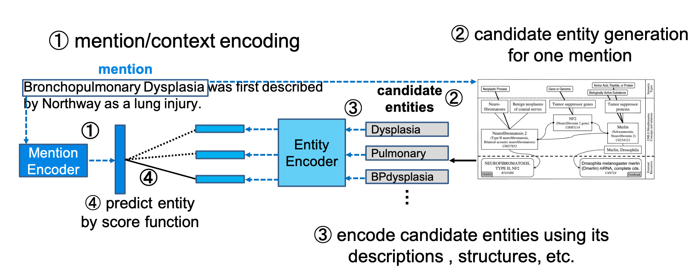

# Entity-Linking-Tutorial
* Tutorial for Bi-encoder based Entity Linking
  - Surface-Candidate based
  
    
  
  - ANN-search based
  
    

# Environment Setup
* First, create base environment with conda.
```
$ conda create -n allennlp python=3.7
$ conda activate allennlp
$ pip install -r requirements.txt
```
* Second, download preprocessed files from [here](https://drive.google.com/drive/folders/1P-iXskc-hbqXateWh3wRknni_knqsagN?usp=sharing), then unzip.

* Third, run `python3 preprocess_mesh.py`

# Model and Scoring

* Derived from [[Logeswaran et al., '19]](https://arxiv.org/abs/1906.07348)

# Experiment and Evaluation
`$ python3 main.py`

# Parameters
WIP

# Result
* Surface-Candidate based
  
  | Generated Candidates Num | 5     | 10    | 20    |
  |--------------------------|-------|-------|-------|
  | dev_recall               | 76.80 | 79.91 | 80.92 |
  | dev_acc                  | 59.85 | 52.56 | 47.23 |
  | test_recall              | 74.35 | 77.14 | 78.25 |
  | test_acc                 | 58.51 | 51.38 | 45.69 |

* ANN-search Based
  
  * Generated Candidates Num: 50 (Fixed)
  
  | Recall@X   | 1 (Acc.) | 5     | 10    | 50    |
  |------------|----------|-------|-------|-------|
  | dev_recall | 21.58    | 42.28 | 50.48 | 67.11 |
  | test_recall| 21.50    | 40.29 | 47.95 | 64.52 |


# Docs for English
WIP

# Docs for Japanese
* [Part 1: History](https://qiita.com/izuna385/items/9d658620b9b96b0b4ec9)
* [Part 2: Preprocecssing](https://qiita.com/izuna385/items/c2918874fbb564acf1e0)
* [Part 3: Model and Evaluation](https://qiita.com/izuna385/items/367b7b365a2791ee4f8e)
* [Part 4: ANN-search with Faiss](https://qiita.com/izuna385/items/bce14031e8a443a0db44)

# LICENSE
MIT