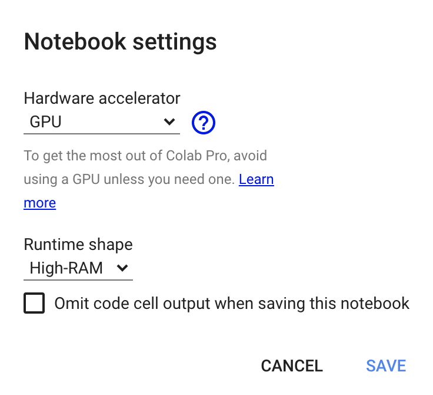
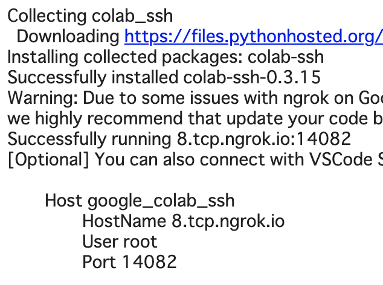
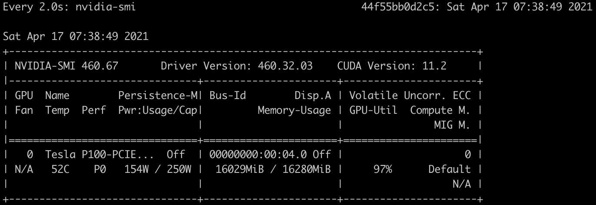

# Tutorial with Colab-Pro

* In this article, our goal is to reproduce the experiment in Colab-Pro. 

* The prerequisite is that you already have a Colab-Pro subscription.

## Colab-setup 

* Access [here](https://colab.research.google.com/notebooks/welcome.ipynb?hl=en).

* Create New Notebook.

* Click [Runtime] -> [Change Runtime Type] and then change the settings as follows.

  
  
* Then click [SAVE].

* Kill all other sessions from [RUNTIME] -> [Manage Sessions] -> [TERMINATE OTHER SESSIONS].

## ssh-setup

* Access [here](https://dashboard.ngrok.com/get-started/your-authtoken) and then copy Token.

* Run this command in your colab-pro session.

  ```python
  !pip install colab_ssh --upgrade
  from colab_ssh import launch_ssh
  ngrokToken = "your_authtoken" # Copied token
  launch_ssh(ngrokToken, password="your_password")
  ```

* If it succeeds, the ssh destination will be specified.

  
  
* In this example, run `ssh root@8.tcp.ngrok.io -p 14082` on your local machine.

## Experimental Setup
### Environment
```
$ git clone https://github.com/izuna385/Entity-Linking-Tutorial
$ cd https://github.com/izuna385/Entity-Linking-Tutorial
$ pip install -r requirements.txt
```

### Preprocessed file
See [here](https://github.com/izuna385/Entity-Linking-Tutorial#preprocessing).


## Experiment

`python3 main.py -num_epochs 10 -batch_size_for_train 48`


  
  
  
  